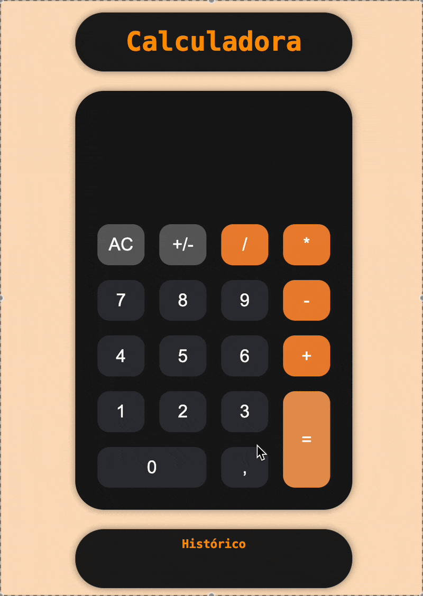
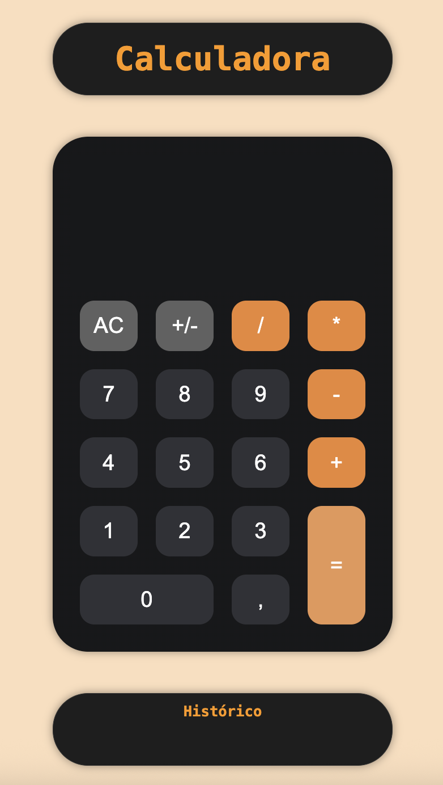

# 📟 Calculadora - Javascript

<div align='center'>

</div>

Uma calculadora simples desenvolvida com HTML, CSS e JavaScript puro. Inclui funcionalidades básicas como soma, subtração, multiplicação, divisão e histórico de operações.

## 🧰 Tecnologias usadas


- HTML5
- CSS3 (modularizado)
- JavaScript (modular, com ES Modules)

## ⚙️ Funcionalidades

- Adição, subtração, multiplicação e divisão
- Botão de limpar display
- Inversão de sinal (positivo/negativo)
- Histórico de operações
- Compatibilidade com vírgula decimal (estilo brasileiro)
- Responsivo (funciona bem em dispositivos móveis)
- Código documentado com JSDoc e comentários CSS

## 🧱 Estrutura de pastas

```
📁 projeto/
├── index.html
├── css/
│   ├── base.css
│   ├── layout.css
│   ├── display.css
│   ├── botoes.css
│   ├── historico.css
│   ├── responsivo.css
│   └── style.css
├── scripts/
│   ├── app.js
│   ├── operacoes.js
│   ├── evento.js
│   ├── adicionarHistorico.js
│   └── bloquearInput.js
```

## 🚀 Como usar

1. Baixe ou clone o repositório:
   ```bash
   git clone https://github.com/seuusuario/calculadora-js.git
   ```

2. Abra o arquivo `index.html` no navegador.

✅ Não precisa de servidor, build ou instalação. É 100% HTML + JS puro.

3. 🔗 [Acesse o projeto online](https://calculadora-tau-lemon.vercel.app/)

### 🖥️ Interface da calculadora

<div align='center'>

</div>

## 🧑‍💻 Autor

Desenvolvido por **Rinelly Vasconcelos**

---

Se quiser contribuir ou sugerir melhorias, fique à vontade para abrir uma issue ou enviar um pull request!